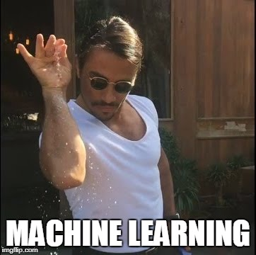

---
output:
  pdf_document: default
  html_document: default
---

# Using Machine Learning for Mechanical Design {#From CAD Monkeys to CAD Robots}

```{r}
knitr::include_graphics('img/evolution-of-design.jpg')
```

#### Keywords {-}

mechanical engineering, computer aided design (CAD)

## The (Non)Software Engineer

In many ways, mechanical engineers are just glorified jigsaw puzzle solvers.  Often times, our job is to take from a virtually infinite number of puzzle pieces and put them together in a way that is not only functionally useful but also cost-effective.  On the simple side, puzzle pieces can be a modest screw; on the complex, an intricate engine.  If we're lucky, things fit together nicely and no pieces are missing from the box.  But more often than not, we have to craft our own pieces--hence the "design" portion of mechanical design.  And with the advent and proliferation of computer aided design (CAD), pen and paper have become 1s and 0s.  Software is already ubiquitous in the mechanical engineer's workflow recipe.  Perhaps it is time to sprinkle in some machine learning.

```{r}

```

## Teaching Old Dogs New Tricks

When I have to design a fixture to help move a box of length L, width W, and height H through over a distance of D, another fellow mechanical engineer has almost surely completed a similar problem already.  If MEs gave each design a classification for use with a supervised learning algorithm, we can start building an algorithm to solve common problems.  Design a door and label it as such and feed it into the algorithm.  When the algorithm has seen enough doors, just start asking for one by name.

* Need to bolt two pieces of sheet metal together?  Let the algorithm select a bolt pattern and the proper size hardware.
* Need to get water between inlet and outlet manifolds?  Let the algorithm choose the correct tubing and route it for you.
* Want to design a sleek electric car that is envy of all automotive companies?  Elon Musk beat you to that one, but it doesn't hurt to consult the algorithm for some ideas anyways.

Of course, the real strength in a machine learning algorithm lies not in its ability to recommend previous designs.  The real power in an ML algorithm lies in its ability to learn and adapt to each engineer's tastes and needs.  If you do not like a design that the algorithm outputs, tell it where it went wrong and let it recalculate a solution.  Maybe you wanted a sliding door rather than a hinged one.  Configure your cost function to penalize rotational designs more than translational ones.  In the beginning, the algorithm may be as awkward as someone trying to push square pegs into round holes.  But, as the neural network evolves, not only will it suggest round pegs, it may start pointing out how the hole doesn't even need to be filled.  Algorithm outputs may eventually move away from being simple enough to be described by words like "door" into complex assemblies that can only be described as "that thing that does the thing that I want it to do".

```{r}
knitr::include_graphics('img/dilbert_architect_comic_cad_monkey.jpg')
```

The questions of how design communities can "effectively use the design data they generate to help manage their operations and improve their designs" is not a new one [@fuge_collaborative_2014].  Fuge describes machine learning within mechanical engineering design as "Computation Design Synthesis". The field is obviously already being explored but I think the important problem here is one of adoption.  Going to work with many experienced (read older) MEs everyday, it is difficult enough to get them to switch over to Chrome from Internet Explorer, let alone adopt an entirely new design paradigm.

## The Paradigm Shift

Getting a machine learning algorithm to a state where it can actually output useful mechanical designs will obviously take some time.  There will be growing pains, as mechanical engineers learn to deal with not only explaining their design intent to their managers but also to a computer--and the latter often requires much more coddling.  However, I believe that the utility in such a system would greatly streamline an ME's workflow.  Can a single engineer eventually design a space ship to Mars?  Maybe it'll eventually be possible--with the digitized knowledge of countless of other aerospace engineers at his or her fingertips: it's just rocket science after all.

That does beg the obvious question: who really deserves the credit for the algorithm's designs?  There may not be an obvious answer and I certainly don't profess to have it.  Moreover, modern companies are already very tight-lipped about their existing designs (a certain fruit immediately comes to mind).  And perhaps this algorithm will never cross chasm between different companies and design firms.  But, it is fun to imagine the type of toys a worldwide engineering collective could dream up.